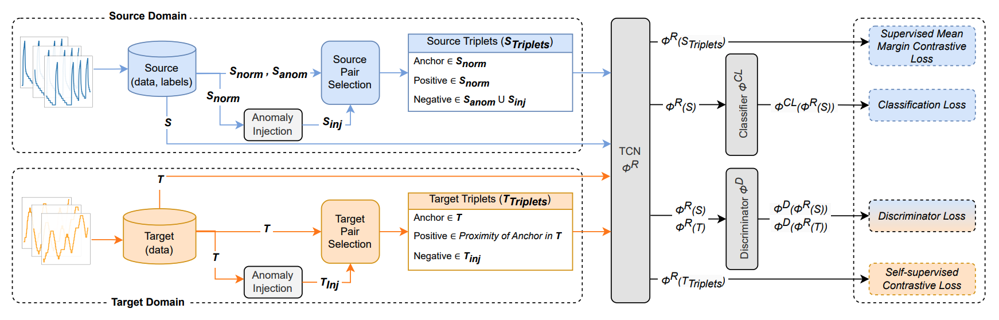
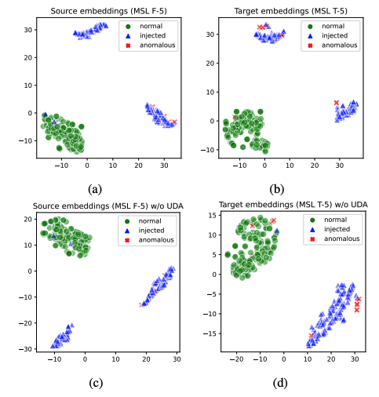

# DACAD: Domain Adaptation Contrastive Learning for Anomaly Detection in Multivariate Time Series

This repository contains the source code for the research article "*[DACAD: Domain Adaptation Contrastive Learning for Anomaly Detection in Multivariate Time Series](https://arxiv.org/abs/2404.11269)*" by 
- [Zahra Z. Darban](https://scholar.google.com/citations?user=wl6XsiwAAAAJ&hl=en) [Monash University],
- [Yiyuan Yang](https://scholar.google.com/citations?user=FUuGvZIAAAAJ) [University of Oxford],
- [Geoffrey I. Webb](https://scholar.google.com/citations?user=_1tpf8AAAAAJ&hl=en) [Monash University], 
- [Charu C. Aggarwal](https://scholar.google.com/citations?user=x_wsduUAAAAJ&hl=en) [IBM], and 
- [Qingsong Wen](https://scholar.google.com/citations?user=vjPJvwYAAAAJ&hl=en) [Squirrel AI]
- [Mahsa Salehi](https://scholar.google.com/citations?user=tTxJ1owAAAAJ&hl=en) [Monash University]


The code is implemented in Python using the PyTorch framework.

## Introduction / Model Architecture

In time series anomaly detection (TSAD), the scarcity of labeled data poses a challenge to the development of accurate models. Unsupervised domain adaptation (UDA) offers a solution by leveraging labeled data from a related domain to detect anomalies in an unlabeled target domain. However, existing UDA methods assume consistent anomalous classes across domains. To address this limitation, we propose a novel Domain Adaptation Contrastive learning model for Anomaly Detection in multivariate time series (DACAD), combining UDA with contrastive learning. DACAD utilizes an anomaly injection mechanism that enhances generalization across unseen anomalous classes, improving adaptability and robustness. Additionally, our model employs supervised contrastive loss for the source domain and self-supervised contrastive triplet loss for the target domain, ensuring comprehensive feature representation learning and domain-invariant feature extraction. Finally, an effective Centre-based Entropy Classifier (CEC) accurately learns normal boundaries in the source domain. Extensive evaluations on multiple real-world datasets and a synthetic dataset highlight DACAD's superior performance in transferring knowledge across domains and mitigating the challenge of limited labeled data in TSAD.



**DACAD Model Overview:** Involves source ($S$) and target ($T$) domains. The source domain uses normal ($S_{\text{norm}}$) and anomalous ($S_{\text{anom}}$) samples, plus synthetic anomalies ($S_{\text{inj}}$) for source triplets ($S_{\text{Triplets}}$) and contrastive loss. The target domain similarly uses proximity-based pair selection and anomaly injection ($T_{\text{inj}}$) to create target triplets ($T_{\text{Triplets}}$). TCN ($\phi^R$) is used for feature extraction. Features from both domains are fed into the discriminator ($\phi^D$) for domain-invariant learning. Source features are classified by the classifier ($\phi^{CL}$).

To elucidate the effectiveness of UDA within DACAD, we examine the feature representations from the MSL dataset, as illustrated below. It presents the t-SNE 2D embeddings of DACAD feature representations $\phi^{CL}(\phi^{R}(w))$ for the MSL dataset. Each point represents a time series window, which can be normal, anomalous, or anomaly-injected. These representations highlight the domain discrepancies between source and target entities and demonstrate how DACAD aligns the time series window features effectively. The comparison of feature representations with and without UDA reveals a significant domain shift when UDA is not employed, between source (entity F-5) and the target (entity T-5) within the MSL dataset.



## Installation

To use the code, follow these steps:

1. Clone the repository:

```bash
git clone https://github.com/zamanzadeh/DACAD.git
cd DACAD
```

2. Create a virtual environment and activate it:

```bash
python -m venv dacad-env
source dacad-env/bin/activate # On Windows use `dacad-env\Scripts\activate`
```

3. Install the required packages:

```bash
pip install -r requirements.txt
```

## Usage

### Where to set the datasets and find the results:

```
DACAD
|
|- datasets [datasets should be placed here]
|	|- MSL
|	|- SMD
|	| ...
|- results [find the results here]
|	|- MSL
|	|- SMD
|	| ...
```

### How to run the code:

To train and evaluate the model, use the following commands:

#### MSL / SMAP datasets
```bash
python main/main_MSL
```

#### SMD dataset
```bash
python main/main_SMD
```

#### Boiler dataset
```bash
python main/main_Boiler
```

## Datasets

We evaluate the performance of the proposed model and compare the results across the seven most commonly used real benchmark datasets for Time Series Anomaly Detection (TSAD).

- **NASA Datasets** -- **Mars Science Laboratory (MSL)** and **Soil Moisture Active Passive (SMAP)** ([source](https://www.kaggle.com/datasets/patrickfleith/nasa-anomaly-detection-dataset-smap-msl)) are collected from NASA spacecraft and contain anomaly information from incident reports for a spacecraft monitoring system.

- **Server Machine Dataset (SMD)** ([source](https://github.com/NetManAIOps/OmniAnomaly/tree/master/ServerMachineDataset)) is gathered from 28 servers over 10 days, with normal data observed for the first 5 days and anomalies sporadically injected in the last 5 days.

- **Boiler Fault Detection Dataset** ([source](https://github.com/DMIRLAB-Group/SASA-pytorch/tree/main/datasets/Boiler)) includes sensor information from three separate boilers, with each boiler representing an individual domain. The objective of the learning process is to identify the malfunctioning blowdown valve in each boiler.


## Citation

If you use this code in your research, please cite the following article:

```bibtex
@article{darban2024dacad,
  title={DACAD: Domain Adaptation Contrastive Learning for Anomaly Detection in Multivariate Time Series},
  author={Darban, Zahra Zamanzadeh and Yang, Yiyuan and Webb, Geoffrey I and Aggarwal, Charu C. and Wen, Qingsong and Salehi, Mahsa},
  journal={arXiv preprint arXiv:2404.11269},
  year={2024}
}
```

## License

This project is licensed under the MIT License - see the [LICENSE](LICENSE) file for details.

